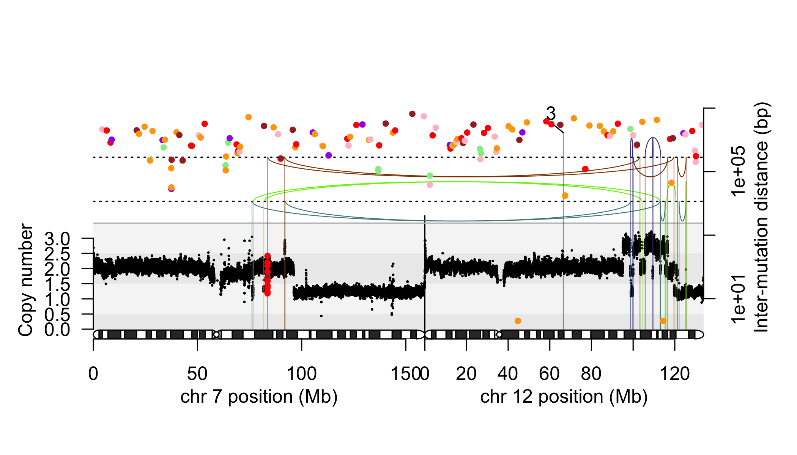

# campbellgram

*Joint visualisation of rearrangement junctions and copy number in somatic genomes.*

## Usage

    campbellgram(hs37d5_chrom_sizes, example_bedpe, chrs_used = c("7", "12"),
                 cn_bedgraph = example_cn, muts = example_mut)

## Features

* Joint visualisation of:
	* Rearrangement junctions in *BEDPE* format.
	* Absolute copy number in *bedGraph* format.
	* Optionally, chromokataegis in BED format.

## Credits

* My PhD supervisors Peter Campbell and Mike Stratton.
* Dr Jose Tubio for coining the name of the package.
